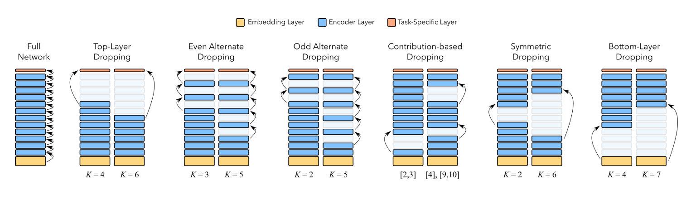

# Dialog System NLU
Dialog NLU library that contains Tensorflow and Keras Implementation of the state of the art researches in Dialog System NLU. 

It is built on Tensorflow 2 and Huggingface Transformers library for better models coverage and other languages support.


## Implemented Papers
### NLU Papers
- [BERT for Joint Intent Classification and Slot Filling](https://arxiv.org/abs/1902.10909)
### Model Compression Papers
- [Poor Man’s BERT: Smaller and Faster Transformer Models](https://arxiv.org/abs/2004.03844)
### BERT / ALBERT for Joint Intent Classification and Slot Filling


### Poor Man’s BERT: Smaller and Faster Transformer Models



#### Supported data format:
- Data format as in the paper `Slot-Gated Modeling for Joint Slot Filling and Intent Prediction` (Goo et al):
	- Consists of 3 files:
		- `seq.in` file contains text samples (utterances)
		- `seq.out` file contains tags corresponding to samples from `seq.in`
		- `label` file contains intent labels corresponding to samples from `seq.in`

#### Datasets included in the repo:
- Snips Dataset (`Snips voice platform: an embedded spoken language understanding system for private- by-design voice interfaces` )(Coucke et al., 2018), which is collected from the Snips personal voice assistant. 
	- The training, development and test sets contain 13,084, 700 and 700 utterances, respectively. 
	- There are 72 slot labels and 7 intent types for the training set.


### Integration with Huggingface Transformers library
[Huggingface Transformers](https://github.com/huggingface/transformers) has a lot of transformers-based models. The idea behind the integration is to be able to support more architectures as well as more languages.

Supported Models Architecture:
|Model|Pretrained Model Example|Layer Prunning Support|
|---|---|---|
|TFBertModel|```bert-base-uncased```|Yes|
|TFDistilBertModel|```distilbert-base-uncased```|Yes|
|TFAlbertModel|```albert-base-v1``` or ```albert-base-v2```|Not yet|
|TFRobertaModel|```roberta-base``` or ```distilroberta-base```|Yes|
|TFXLNetModel|```xlnet-base-cased```|No|
And more models integration to come


## Installation
You may choose to create python environment before installation.

```bash
git clone https://github.com/MahmoudWahdan/dialog-nlu.git
cd dialog-nlu
pip install .
```

## Examples:
We provide examples of how to use the library. You can find Jupyter notebboks under [notebooks](https://github.com/MahmoudWahdan/dialog-nlu/tree/master/notebooks) and python scripts [examples](https://github.com/MahmoudWahdan/dialog-nlu/tree/master/examples) of how to use the library

## Training, Evaluation, and simple API script:
We provide [scripts](https://github.com/MahmoudWahdan/dialog-nlu/tree/master/scripts) to train, incremental training, and simple flask API.

## Quick tour

```python
# imports
from dialognlu import TransformerNLU, AutoNLU
from dialognlu.readers.goo_format_reader import Reader

# reading datasets
train_path = "data/snips/train"
val_path = "data/snips/valid"
train_dataset = Reader.read(train_path)
val_dataset = Reader.read(val_path)

# configurations of the model
config = {
    "pretrained_model_name_or_path": "distilbert-base-uncased",
    "from_pt": False,
}
# create a joint NLU model from configurations
nlu_model = TransformerNLU.from_config(config)

# training the model
nlu_model.train(train_dataset, val_dataset, epochs=3, batch_size=64)

# saving model
save_path = "saved_models/joint_distilbert_model"
nlu_model.save(save_path)

# loading the model and do incremental training

# loading model
nlu_model = AutoNLU.load(save_path)

# Continue training
nlu_model.train(train_dataset, val_dataset, epochs=1, batch_size=64)

# evaluate the model
test_path = "../data/snips/test"
test_dataset = Reader.read(test_path)
token_f1_score, tag_f1_score, report, acc = nlu_model.evaluate(test_dataset)
print('Slot Classification Report:', report)
print('Slot token f1_score = %f' % token_f1_score)
print('Slot tag f1_score = %f' % tag_f1_score)
print('Intent accuracy = %f' % acc)

# do prediction
utterance = "add sabrina salerno to the grime instrumentals playlist"
result = nlu_model.predict(utterance)
```

## Use Layer Pruning with NLU model
It is supported only in transformer-based NLU models
```python
# imports
from dialognlu import TransformerNLU, AutoNLU
from dialognlu.readers.goo_format_reader import Reader

# reading datasets
train_path = "data/snips/train"
val_path = "data/snips/valid"
train_dataset = Reader.read(train_path)
val_dataset = Reader.read(val_path)

# configurations of the model
config = {
    "pretrained_model_name_or_path": "distilbert-base-uncased",
    "from_pt": False,
	"layer_pruning": {
        "strategy": "top",
        "k": 2
    }
}
# create a joint NLU model from configurations
nlu_model = TransformerNLU.from_config(config)

# training the model
nlu_model.train(train_dataset, val_dataset, epochs=3, batch_size=64)
```